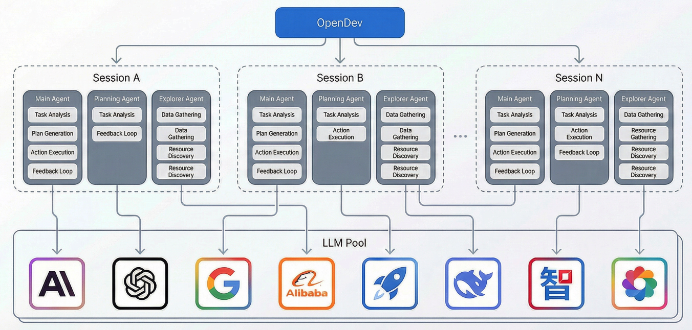

<p align="center">
  
</p>

<p align="center">Open-source AI coding agent that spawns parallel agents, each bound to the LLM of your choice.</p>

<p align="center">
  <a href="https://github.com/kendra-to/kendra/releases/latest"></a>
  <a href="https://github.com/kendra-to/kendra/releases"></a>
  <a href="https://crates.io/crates/kendra-cli"></a>
  <a href="./LICENSE"></a>
  <a href="https://www.rust-lang.org/"></a>
  <a href="https://github.com/kendra-to/kendra/actions/workflows/release.yml"></a>
  <a href="https://arxiv.org/pdf/2603.05344"></a>
</p>

<p align="center">
  <strong>Website and documentation coming soon!</strong>
</p>

<p align="center">
  
</p>

---

### Introduction

KendraCLI is an open-source, terminal-native coding agent built as a compound AI system. Instead of a single monolithic LLM, it uses a structured ensemble of agents and workflows -- each independently bound to a user-configured model.

Work is organized into concurrent sessions composed of specialized sub-agents. Each agent executes typed workflows (Execution, Thinking, Compaction) that independently bind to an LLM, enabling fine-grained cost, latency, and capability trade-offs per workflow.

KendraCLI automatically routes each phase of work to the right model. Five workflow slots — **Normal** (execution), **Thinking** (reasoning), **Compact** (context summarization), **Self-Critique** (output verification), and **VLM** (vision) — each bind independently to any LLM you configure. For example, Claude Opus handles execution, GPT-o3 handles reasoning, and a lightweight Qwen model handles compaction — all routed automatically. Together, these form a compound AI system where multiple models collaborate, each optimized for its role.

KendraCLI is written in **Rust** — it starts in **4.3 ms**, uses just **9.4 MB of memory**, and ships as a single **18 MB binary**. That makes it the **fastest and lightest coding agent** available today — up to **128x faster startup** and **30x less memory** than alternatives.

<div align="center">

| Agent | Startup (mean ± σ) | Peak Memory (median) | Install Size |
|-------|--------:|------------:|-------------:|
| **KendraCLI** 0.1.4 | **4.3 ms ± 0.4 ms** | **9.4 MB** | **18 MB** |
| Codex 0.116.0 | 37.8 ms ± 0.8 ms (9x) | 43.7 MB (4.6x) | 116 MB |
| Claude Code 2.1.87 | 87.3 ms ± 2.0 ms (20x) | 214.6 MB (22.8x) | 188 MB |
| OpenCode 1.2.27 | 557.4 ms ± 31.8 ms (128x) | 285.9 MB (30.4x) | 90 MB |

<sub>macOS ARM64 (Apple Silicon) · Startup: <a href="https://github.com/sharkdp/hyperfine">hyperfine</a> <code>--shell=none --warmup 10 --runs 100</code> · Memory: <code>/usr/bin/time -l</code> median of 20 runs · Multipliers relative to KendraCLI</sub>

</div>

<p align="center">
  
</p>

---

### Why KendraCLI?

- **Blazing fast, ultra lightweight.** 4.3 ms startup, 9.4 MB RAM, 18 MB on disk. Written in Rust with zero interpreter overhead — it launches before other agents finish loading their runtime.
- **Proactive, not reactive.** KendraCLI can plan, execute, and iterate autonomously. Kick off a refactoring, walk away, and come back to a PR ready for review.
- **Multi-provider, multi-model.** Assign different models from different providers to every workflow and session, all running in parallel. Your models, your rules.
- **TUI + Web UI.** A full terminal UI for power users and a Web UI for visual monitoring. The Web UI supports remote sessions, so you can start a task from your phone and let KendraCLI work while you sleep.

---

### ⚡ Agent Fleet — Parallel Execution at Scale

<p align="center">
  
</p>

<p align="center"><em>A fleet of agents, each independently exploring a different crate — all running concurrently in a single session.</em></p>

Need to survey an entire codebase? Refactor across 20 crates? Run a dozen tool calls at once? **Spawn a fleet.**

KendraCLI's agent fleet launches multiple sub-agents in parallel, each with its own LLM binding, context window, and tool access. Because the runtime is written in Rust with fully async I/O, there is zero interpreter overhead — agents fan out across your workspace and converge results back in seconds, not minutes.

```
You                          KendraCLI Fleet
 │                           ┌─ Agent 1 → crate/agents
 │   "survey all crates"     ├─ Agent 2 → crate/http
 │ ─────────────────────►    ├─ Agent 3 → crate/tui
 │                           ├─ Agent 4 → crate/tools
 │                           ├─  ...
 │   ◄── aggregated results  └─ Agent N → crate/config
```

- **Concurrent, not sequential.** Every agent runs its own async task — no GIL, no queue, no waiting.
- **Rust-native performance.** Near-zero overhead per agent. Memory-safe parallelism via Tokio.
- **Independent LLM bindings.** Each agent in the fleet can target a different model or provider.

---

### Installation

#### From crates.io (all platforms)

```bash
cargo install kendra-cli
```

#### macOS

```bash
# Homebrew (recommended)
brew install kendra-to/tap/kendra

# Shell installer
curl --proto '=https' --tlsv1.2 -LsSf https://github.com/kendra-to/kendra/releases/latest/download/kendra-cli-installer.sh | sh

# Or download the binary directly from GitHub Releases:
#   kendra-cli-aarch64-apple-darwin.tar.xz  (Apple Silicon)
#   kendra-cli-x86_64-apple-darwin.tar.xz   (Intel)
```

#### Linux

```bash
# Shell installer (x86_64 and ARM64)
curl --proto '=https' --tlsv1.2 -LsSf https://github.com/kendra-to/kendra/releases/latest/download/kendra-cli-installer.sh | sh

# Or download the binary directly from GitHub Releases:
#   kendra-cli-x86_64-unknown-linux-gnu.tar.xz   (x86_64)
#   kendra-cli-aarch64-unknown-linux-gnu.tar.xz   (ARM64 / Raspberry Pi)
```

#### Windows

```powershell
# PowerShell installer
powershell -ExecutionPolicy ByPass -c "irm https://github.com/kendra-to/kendra/releases/latest/download/kendra-cli-installer.ps1 | iex"

# Or download kendra-cli-x86_64-pc-windows-msvc.zip from GitHub Releases
```

#### From source (all platforms)

Requires [Rust](https://rustup.rs/) 1.94+.

```bash
git clone https://github.com/kendra-to/kendra.git
cd kendra
cargo build --release -p kendra-cli
# Binary at target/release/kendra (or kendra.exe on Windows)
```

If you use the repo for development, you may also have a local symlink at `~/.local/bin/kendra` pointing at `target/release/kendra`. That can take precedence over the Homebrew binary in `/opt/homebrew/bin/kendra`.

To test a Homebrew install from a clean shell state:

```bash
rm -f ~/.local/bin/kendra
hash -r
brew uninstall kendra
brew untap kendra-to/tap
brew tap kendra-to/tap
brew install kendra-to/tap/kendra
which kendra
kendra --version
```

See [DEVELOPMENT.md](./DEVELOPMENT.md) for the full local development and Homebrew testing workflow.

> **All release binaries, checksums, and installers are available on the [GitHub Releases](https://github.com/kendra-to/kendra/releases) page.**

#### Supported platforms

| Platform | Architecture | Binary |
|----------|-------------|--------|
| macOS | Apple Silicon (M1+) | `kendra-cli-aarch64-apple-darwin.tar.xz` |
| macOS | Intel | `kendra-cli-x86_64-apple-darwin.tar.xz` |
| Linux | x86_64 | `kendra-cli-x86_64-unknown-linux-gnu.tar.xz` |
| Linux | ARM64 | `kendra-cli-aarch64-unknown-linux-gnu.tar.xz` |
| Windows | x86_64 | `kendra-cli-x86_64-pc-windows-msvc.zip` |

#### Verify installation

```bash
kendra --version
```

If Homebrew reports `Not a valid ref: refs/remotes/origin/main` while auto-updating the tap, remove the stale local tap clone and retry:

```bash
brew untap kendra-to/tap
brew tap kendra-to/tap
brew install kendra-to/tap/kendra
```

### Quick Start

```bash
# Set an API key (OpenAI, Anthropic, or Fireworks -- any one will do)
export OPENAI_API_KEY="sk-..."
# export ANTHROPIC_API_KEY="sk-ant-..."
# export FIREWORKS_API_KEY="fw_..."

# Start the interactive TUI
kendra

# Or start the Web UI
kendra run ui

# Single prompt (non-interactive)
kendra -p "explain this codebase"

# Resume most recent session
kendra --continue
```

Prefer a guided walkthrough? Run `kendra config setup` to interactively choose providers, models, and workflow bindings.

See the [Provider Setup Guide](docs/providers.md) for all 9 supported providers, authentication details, and advanced configuration.

<p align="center">
  
</p>

### Multi-Provider Support

KendraCLI supports 9 LLM providers: **OpenAI**, **Anthropic**, **Fireworks**, **Google**, **Groq**, **Mistral**, **DeepInfra**, **OpenRouter**, and **Azure OpenAI**.

Each provider's models can be independently assigned to 5 workflow slots:

- **Normal** -- Primary execution model for coding tasks and tool calls
- **Thinking** -- Complex reasoning and planning (falls back to Normal)
- **Compact** -- Context summarization when history grows long (falls back to Normal)
- **Critique** -- Self-critique of agent reasoning (falls back to Thinking)
- **VLM** -- Vision/image processing (falls back to Normal if it supports vision)

Mix and match providers per slot in `~/.kendra/settings.json`:

```json
{
  "model_provider": "anthropic",
  "model": "claude-sonnet-4-20250514",
  "model_thinking_provider": "openai",
  "model_thinking": "o3"
}
```

See the [Provider Setup Guide](docs/providers.md) for the full list of env vars, fallback chains, and configuration options.

### MCP Integration

Dynamic tool discovery via the Model Context Protocol for connecting to external tools and data sources.

```bash
kendra mcp list
kendra mcp add myserver uvx mcp-server-sqlite
kendra mcp enable/disable myserver
```

### Development

```bash
git clone https://github.com/kendra-to/kendra.git
cd kendra
cargo build --workspace
cargo test --workspace
```

```bash
cargo check --workspace       # Type check
cargo clippy --workspace      # Lint
cargo fmt --all               # Format
cargo test -p kendra-cli     # Test a specific crate
```

Detailed local-dev, symlink, Homebrew, and release-testing notes are in [DEVELOPMENT.md](./DEVELOPMENT.md).

### Web UI

The frontend is a React/Vite app in `web-ui/`:

```bash
cd web-ui && npm ci && npm run build
```

### Contributing

If you're interested in contributing to KendraCLI, please open an issue or submit a pull request.

---

### How KendraCLI Compares

- **vs. Claude Code / Codex CLI / Gemini CLI:** Closed-source tools that lock you into a single provider. KendraCLI is fully open source and lets you mix models from any provider, independently bound per workflow (execution, thinking, critique, compaction, vision).
- **vs. OpenCode:** OpenCode is a great open-source coding agent with TUI, Web UI, and LSP support. However, its architecture is not modular enough to support per-workflow model binding, concurrent multi-agent sessions, or compound AI orchestration.
- **vs. OpenClaw:** KendraCLI and OpenClaw share similar concepts around autonomous AI agents. The key difference is focus: KendraCLI is purpose-built for the software development lifecycle, with context engineering, structured agent workflows, and deep code understanding.

---

### Star History

<p align="center">
  <a href="https://star-history.com/#kendra-to/kendra&Date">
   <picture>
     <source media="(prefers-color-scheme: dark)" srcset="https://api.star-history.com/svg?repos=kendra-to/kendra&type=Date&theme=dark" />
     <source media="(prefers-color-scheme: light)" srcset="https://api.star-history.com/svg?repos=kendra-to/kendra&type=Date" />
     
   </picture>
  </a>
</p>

